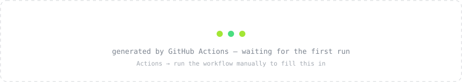
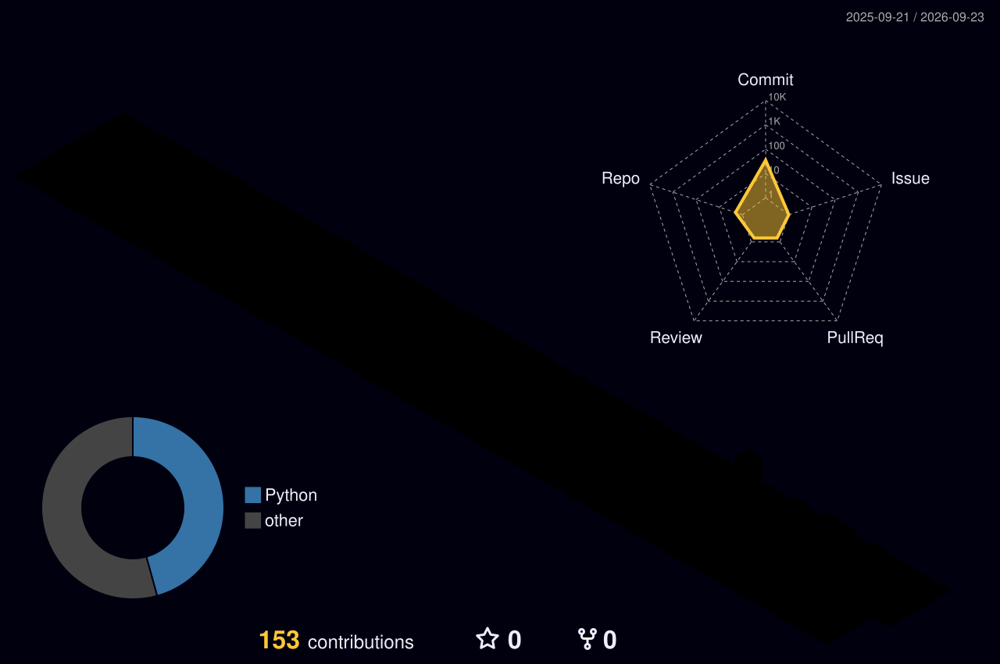
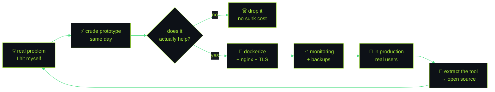

<!-- ─────────────  HERO  ───────────── -->
<picture>
  <source media="(prefers-color-scheme: dark)"  srcset="./assets/hero-dark.svg">
  <source media="(prefers-color-scheme: light)" srcset="./assets/hero-light.svg">
  
</picture>

 

<!-- ─────────────  BADGE ROW  ───────────── -->

 

## `> whoami`

I build small, sharp tools — mostly for **AI agents** — and ship products **end-to-end**:
from the VPS and the nginx config to the payment webhook. Solo, and mostly in public.

- 🧩 **Open source first.** My tools start as something I needed myself, then get cleaned up and released.
- 🛠 **Full stack, literally.** Same person writes the scraper, the Docker Compose, the TLS config and the billing logic.
- 🧪 **Ship > polish.** A running service with real users beats a perfect prototype.

> [!NOTE]
> **Currently building:** an MCP toolbelt for autonomous agents (`freecrawl`), plus a production subscription service with online payments. Open to collaboration on MCP servers and agent tooling.

 

## `> ls ./open-source`

<a href="https://github.com/kostya5524/freecrawl">
  <picture>
    <source media="(prefers-color-scheme: dark)"  srcset="./assets/card-freecrawl-dark.svg">
    <source media="(prefers-color-scheme: light)" srcset="./assets/card-freecrawl-light.svg">
    
  </picture>
</a>

**`freecrawl`** — an MCP server that gives an AI agent **29 web tools**: read bot-protected pages,
search across multiple engines, reverse image search, structured extraction, change monitoring.
Runs locally, **no API keys required**.

  
  
  
  

 

## `> cat ./what-i-ship`

<table>
<tr>
<td width="50%" valign="top">

### 🤖 AI tooling & MCP
MCP servers, agent toolbelts, LLM integrations.
A Telegram AI bot running serverless on **Cloudflare Workers** — no VPS, no cold-start bills.

`Python` · `MCP` · `Workers` · `LLM APIs`

</td>
<td width="50%" valign="top">

### 💳 Subscription SaaS
A production service with real customers: online payments and webhooks,
customer dashboard, admin panel, live balance and health monitoring.

`Flask` · `PostgreSQL` · `nginx` · `payments`

</td>
</tr>
<tr>
<td width="50%" valign="top">

### 🐳 Self-hosted infra
Docker, nginx, TLS, backups, off-site replication, uptime alerts to Telegram.
Home cloud + media server running 24/7 on my own hardware.

`Docker` · `nginx` · `Linux` · `OpenWrt`

</td>
<td width="50%" valign="top">

### 🌐 Web apps
Small focused web apps that solve one problem well:
a training platform on Flask + SQLite, internal tools, custom players.

`Flask` · `Next.js` · `SQLite` · `TypeScript`

</td>
</tr>
</table>

 

## `> stack --list`

**Languages**

**Backend & data**

**Infra & ops**

**AI & automation**

 

## `> git log --stat`

<!-- Generated nightly by my own GitHub Action (see .github/workflows/metrics.yml),
     not by a third-party service — so it does not go down with someone else's quota. -->
<picture>
  <source media="(prefers-color-scheme: dark)"  srcset="./assets/metrics-overview-dark.svg">
  <source media="(prefers-color-scheme: light)" srcset="./assets/metrics-overview-light.svg">
  
</picture>

 

<picture>
  <source media="(prefers-color-scheme: dark)"  srcset="./assets/metrics-languages-dark.svg">
  <source media="(prefers-color-scheme: light)" srcset="./assets/metrics-languages-light.svg">
  
</picture>
<picture>
  <source media="(prefers-color-scheme: dark)"  srcset="./assets/metrics-isocalendar-dark.svg">
  <source media="(prefers-color-scheme: light)" srcset="./assets/metrics-isocalendar-light.svg">
  
</picture>

 

<picture>
  <source media="(prefers-color-scheme: dark)"  srcset="https://streak-stats.demolab.com/?user=kostya5524&background=00000000&stroke=30363d&border=30363d&ring=a3e635&fire=4ade80&currStreakLabel=a3e635&sideLabels=c9d1d9&currStreakNum=c9d1d9&sideNums=c9d1d9&dates=7d8590&hide_border=false">
  <source media="(prefers-color-scheme: light)" srcset="https://streak-stats.demolab.com/?user=kostya5524&background=00000000&stroke=d0d7de&border=d0d7de&ring=1a7f37&fire=2da44e&currStreakLabel=1a7f37&sideLabels=1f2328&currStreakNum=1f2328&sideNums=1f2328&dates=656d76&hide_border=false">
  
</picture>

  

<picture>
  <source media="(prefers-color-scheme: dark)"  srcset="https://github-readme-activity-graph.vercel.app/graph?username=kostya5524&bg_color=00000000&color=a3e635&line=4ade80&point=d9f99d&area=true&hide_border=true&custom_title=Contribution%20activity">
  <source media="(prefers-color-scheme: light)" srcset="https://github-readme-activity-graph.vercel.app/graph?username=kostya5524&bg_color=00000000&color=1a7f37&line=2da44e&point=1a7f37&area=true&hide_border=true&custom_title=Contribution%20activity">
  
</picture>

 

## `> ./contributions --animate`

<picture>
  <source media="(prefers-color-scheme: dark)"  srcset="https://raw.githubusercontent.com/kostya5524/kostya5524/output/github-snake-dark.svg">
  <source media="(prefers-color-scheme: light)" srcset="https://raw.githubusercontent.com/kostya5524/kostya5524/output/github-snake.svg">
  
</picture>

<b>🧊 The same contributions, in 3D</b>

 
<picture>
  <source media="(prefers-color-scheme: dark)"  srcset="./profile-3d-contrib/profile-night-rainbow.svg">
  <source media="(prefers-color-scheme: light)" srcset="./profile-3d-contrib/profile-green-animate.svg">
  
</picture>

<b>📊 When do I actually commit?</b>

 
<picture>
  <source media="(prefers-color-scheme: dark)"  srcset="./assets/metrics-habits-dark.svg">
  <source media="(prefers-color-scheme: light)" srcset="./assets/metrics-habits-light.svg">
  
</picture>

 

## `> ./how-i-work`

 

## `> tail -f ./activity`

<!--START_SECTION:activity-->
<!-- This block is filled automatically by GitHub Actions. -->
<!--END_SECTION:activity-->

 

<b>🇷🇺 То же самое по-русски</b>

 

### Кто я

Делаю небольшие острые инструменты — в основном **для AI-агентов** — и довожу продукты
**до конца**: от VPS и конфига nginx до вебхука оплаты. В одиночку и по возможности публично.

- 🧩 **Сначала open source.** Инструмент рождается из своей же задачи, потом причёсывается и выкладывается.
- 🛠 **Полный стек буквально.** Один человек пишет и парсер, и docker-compose, и TLS, и биллинг.
- 🧪 **Запустить важнее, чем вылизать.** Работающий сервис с живыми пользователями лучше идеального прототипа.

### Чем занимаюсь

| Направление | Что это |
|---|---|
| 🤖 **AI-инструменты и MCP** | MCP-серверы, наборы инструментов для агентов, интеграции с LLM. Telegram-бот на Cloudflare Workers — без VPS |
| 💳 **SaaS на подписке** | Боевой сервис с живыми клиентами: онлайн-оплаты и вебхуки, личный кабинет, админка, мониторинг |
| 🐳 **Self-hosted инфраструктура** | Docker, nginx, TLS, бэкапы с off-site репликацией, алерты в Telegram. Домашнее облако и медиасервер 24/7 |
| 🌐 **Веб-приложения** | Небольшие приложения под одну задачу: обучающая платформа на Flask + SQLite, внутренние инструменты, плееры |

### Открытый код

**`freecrawl`** — MCP-сервер, дающий AI-агенту **29 инструментов работы с вебом**: чтение страниц
с антибот-защитой, поиск по нескольким движкам, обратный поиск картинок, извлечение данных,
наблюдение за изменениями. Работает локально, **без ключей API**.

### Как со мной связаться

Issues и Discussions в репозиториях — самый быстрый путь. Контакты — ниже.

 

## `> contact`

Issues and Discussions are the fastest way to reach me — I read every one.

  

<picture>
  <source media="(prefers-color-scheme: dark)"  srcset="./assets/footer-dark.svg">
  <source media="(prefers-color-scheme: light)" srcset="./assets/footer-light.svg">
  
</picture>

